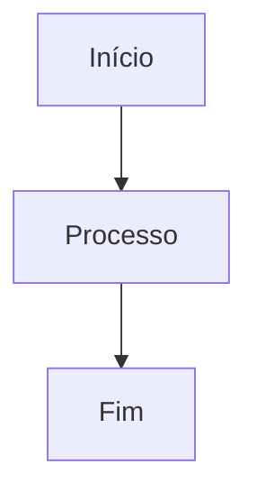

# Contribuir para a Documentação

Este guia explica como contribuir para a documentação do Neodoo18Framework de forma eficaz.

## Estrutura da Documentação

A documentação do Neodoo18Framework está organizada da seguinte forma:

- `docs/` - Diretório principal de documentação
  - `index.md` - Página inicial e ponto de entrada da documentação
  - `quick-guide.md` - Guia de início rápido
  - `workflows.md` - Fluxos de trabalho e processos
  - `faq.md` - Perguntas frequentes
  - `glossary.md` - Glossário de termos
  - `assets/` - Imagens e outros recursos
  - `.obsidian/` - Configurações do Obsidian

## Padrões de Documentação

### Formatação Markdown

Utilize os recursos do Markdown para formatar o conteúdo:

```markdown
# Título de Nível 1
## Título de Nível 2
### Título de Nível 3

**Texto em negrito**
*Texto em itálico*

- Item de lista
- Outro item
  - Sub-item

1. Item numerado
2. Outro item numerado

> Citação ou nota importante

`código inline`

```python
# Bloco de código com destaque de sintaxe
def example_function():
    return True
```

[Link para outra página](path/to/page.md)


```

### Links Internos no Obsidian

Para links internos, utilize a sintaxe do Obsidian:

```markdown
[[nome-do-arquivo]] - Link simples
[[nome-do-arquivo|Texto personalizado]] - Link com texto personalizado
```

### Adornos no Obsidian

Utilize adornos (callouts) para destacar informações importantes:

```markdown
> [!NOTE]
> Esta é uma nota informativa.

> [!WARNING]
> Este é um aviso importante.

> [!TIP]
> Esta é uma dica útil.

> [!IMPORTANT]
> Esta é uma informação crítica.
```

### Diagramas Mermaid

Utilize Mermaid para criar diagramas:

```markdown

```

## Processo de Contribuição

1. **Fork do Repositório**: Faça um fork do repositório principal.
2. **Clone Local**: Clone seu fork para trabalho local.
3. **Crie uma Branch**: Crie uma branch para suas alterações.
4. **Faça as Alterações**: Edite ou adicione arquivos de documentação.
5. **Teste Localmente**: Abra os arquivos no Obsidian para verificar a formatação.
6. **Commit e Push**: Faça commit das alterações e envie para seu fork.
7. **Pull Request**: Crie um Pull Request para o repositório principal.

## Diretrizes de Qualidade

- **Precisão**: Certifique-se de que as informações estão corretas e atualizadas.
- **Clareza**: Escreva de forma clara e concisa.
- **Exemplos**: Inclua exemplos práticos sempre que possível.
- **Consistência**: Mantenha um estilo consistente em toda a documentação.
- **Links**: Verifique se todos os links internos e externos funcionam.
- **Imagens**: Use imagens quando ajudarem a explicar conceitos complexos.

## Usando o Obsidian

### Configuração Inicial

1. Baixe e instale o [Obsidian](https://obsidian.md/)
2. Abra o Obsidian e selecione "Abrir pasta como cofre"
3. Navegue até a pasta `docs` do Neodoo18Framework

### Recursos Úteis do Obsidian

- **Visão de Gráfico**: Mostra as conexões entre os documentos.
- **Backlinks**: Mostra quais documentos fazem referência ao documento atual.
- **Painel de Outline**: Mostra a estrutura do documento atual.
- **Pesquisa**: Permite encontrar rapidamente conteúdo em todos os documentos.

## Templates de Documentação

### Template para Documentação de Funcionalidade

```markdown
# Nome da Funcionalidade

## Visão Geral
Breve descrição da funcionalidade.

## Como Usar
Instruções passo a passo.

## Exemplos
Exemplos de código ou uso.

## Parâmetros
Descrição dos parâmetros.

## Observações
Informações adicionais importantes.

## Veja Também
Links relacionados.
```

### Template para Documentação de Processo

```markdown
# Nome do Processo

## Objetivo
O que este processo visa alcançar.

## Pré-requisitos
O que é necessário antes de iniciar este processo.

## Etapas
1. Primeira etapa
2. Segunda etapa
3. Terceira etapa

## Resultado Esperado
O que deve acontecer quando o processo é concluído com sucesso.

## Solução de Problemas
Problemas comuns e como resolvê-los.
```

## Recursos Adicionais

- [Guia de Markdown](https://www.markdownguide.org/)
- [Documentação do Obsidian](https://help.obsidian.md/)
- [Sintaxe Mermaid](https://mermaid-js.github.io/mermaid/#/)