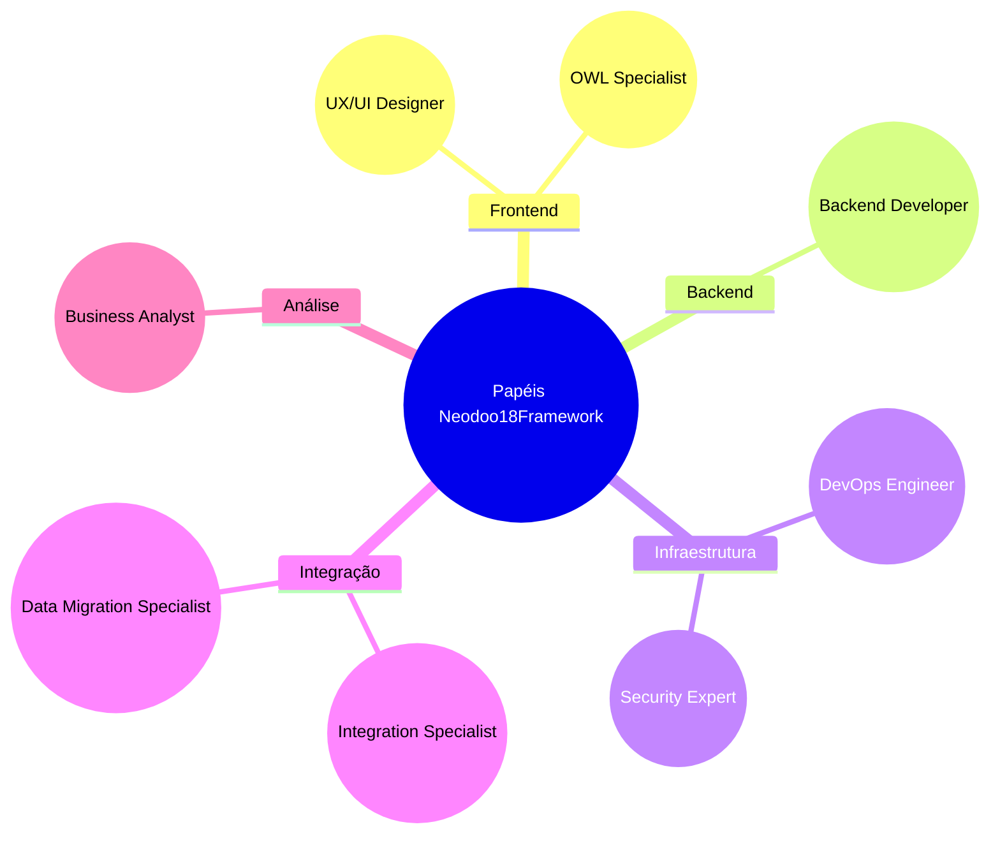
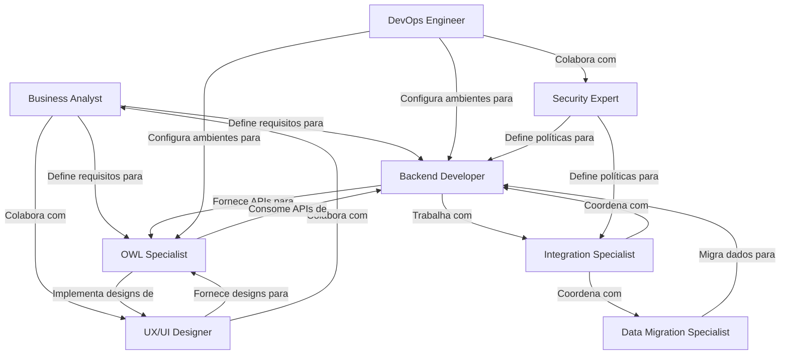

# Guia dos Papéis Especializados

Este documento fornece uma visão geral dos papéis especializados definidos no Neodoo18Framework para desenvolvimento Odoo 18+.

## 🧩 Estrutura de Papéis

O Neodoo18Framework define papéis especializados para garantir que cada aspecto do desenvolvimento Odoo 18+ seja abordado por especialistas com habilidades específicas. Esta estrutura permite uma colaboração eficaz e uma divisão clara de responsabilidades.

## 🎨 Frontend

### OWL Specialist

O **OWL Specialist** é responsável por implementar interfaces de usuário utilizando o framework OWL (Odoo Web Library) do Odoo 18+.

**Principais responsabilidades:**
- Desenvolvimento de componentes OWL
- Implementação de hooks e serviços
- Otimização de performance frontend
- Integração com APIs backend

**Recursos:**
- [[../framework/roles/OWL_SPECIALIST|Documentação Completa do OWL Specialist]]

### UX/UI Designer

O **UX/UI Designer** é responsável por criar interfaces intuitivas e atraentes para aplicações Odoo 18+, garantindo uma excelente experiência do usuário.

**Principais responsabilidades:**
- Design de interfaces de usuário
- Prototipação e wireframing
- Testes de usabilidade
- Implementação de diretrizes de acessibilidade

**Recursos:**
- [[../framework/roles/UXUI_DESIGNER|Documentação Completa do UX/UI Designer]]

## 💻 Backend

### Backend Developer

O **Backend Developer** é responsável pela implementação da lógica de negócios e estruturas de dados usando o framework ORM do Odoo 18+.

**Principais responsabilidades:**
- Criação e extensão de modelos
- Implementação de lógica de negócios
- Desenvolvimento de APIs
- Otimização de consultas e performance

**Recursos:**
- [[../framework/roles/BACKEND_DEVELOPER|Documentação Completa do Backend Developer]]

## 🛠️ Infraestrutura

### DevOps Engineer

O **DevOps Engineer** é responsável por configurar, implementar e manter ambientes Odoo 18+, garantindo disponibilidade, escalabilidade e performance.

**Principais responsabilidades:**
- Configuração de ambientes
- Implementação de CI/CD
- Monitoramento e alertas
- Otimização de performance
- Recuperação de desastres

**Recursos:**
- [[../framework/roles/DEVOPS_ENGINEER|Documentação Completa do DevOps Engineer]]

### Security Expert

O **Security Expert** é responsável por implementar controles de segurança e garantir a proteção de dados em aplicações Odoo 18+.

**Principais responsabilidades:**
- Implementação de controles de acesso
- Auditoria de segurança
- Conformidade regulatória
- Proteção de dados sensíveis

**Recursos:**
- [[../framework/roles/SECURITY_EXPERT|Documentação Completa do Security Expert]]

## 🔄 Integração

### Integration Specialist

O **Integration Specialist** é responsável por conectar sistemas Odoo 18+ com aplicações externas e serviços de terceiros.

**Principais responsabilidades:**
- Desenvolvimento de APIs e webhooks
- Integração com sistemas externos
- Implementação de padrões de integração
- Monitoramento de integrações

**Recursos:**
- [[../framework/roles/INTEGRATION_SPECIALIST|Documentação Completa do Integration Specialist]]

### Data Migration Specialist

O **Data Migration Specialist** é responsável por planejar e executar migrações de dados de sistemas legados para o Odoo 18+ ou entre versões do Odoo.

**Principais responsabilidades:**
- Planejamento de migração
- Mapeamento de dados
- Transformação e limpeza de dados
- Validação de dados migrados

**Recursos:**
- [[../framework/roles/DATA_MIGRATION_SPECIALIST|Documentação Completa do Data Migration Specialist]]

## 📊 Análise

### Business Analyst

O **Business Analyst** é responsável por entender os requisitos de negócio e traduzi-los em soluções técnicas no contexto do Odoo 18+.

**Principais responsabilidades:**
- Levantamento e análise de requisitos
- Mapeamento de processos
- Documentação de especificações
- Testes e validação de soluções

**Recursos:**
- [[../framework/roles/BUSINESS_ANALYST|Documentação Completa do Business Analyst]]

## 👥 Colaboração entre Papéis

A efetiva colaboração entre os diferentes papéis é fundamental para o sucesso de projetos Odoo 18+. Abaixo estão algumas das principais interações entre os papéis:

## 📋 Matriz de Responsabilidades RACI

| Atividade | Business Analyst | Backend Developer | OWL Specialist | UX/UI Designer | DevOps Engineer | Security Expert | Integration Specialist | Data Migration Specialist |
|-----------|-----------------|-------------------|---------------|---------------|----------------|----------------|----------------------|--------------------------|
| Levantamento de requisitos | R | C | C | C | I | C | C | C |
| Design da interface | C | I | C | R | I | C | I | I |
| Desenvolvimento de modelos | C | R | I | I | I | C | C | C |
| Desenvolvimento de UI | I | C | R | C | I | I | I | I |
| Configuração de ambiente | I | C | C | I | R | C | C | C |
| Implementação de segurança | C | C | C | I | C | R | C | C |
| Desenvolvimento de integrações | C | C | C | I | C | C | R | C |
| Migração de dados | C | C | I | I | C | C | C | R |
| Implantação | I | C | C | I | R | C | C | C |
| Testes | C | C | C | C | C | C | C | C |

**Legenda:**
- **R**: Responsável (executa a atividade)
- **A**: Aprovador (aprova o trabalho)
- **C**: Consultado (fornece input)
- **I**: Informado (mantido atualizado)

## 🚀 Como Usar esta Documentação

1. **Identifique seu papel**: Determine qual papel corresponde melhor às suas responsabilidades no projeto.
2. **Estude a documentação específica**: Aprofunde-se na documentação detalhada do seu papel.
3. **Conheça interfaces**: Entenda como seu papel se relaciona com outros papéis.
4. **Aplique as melhores práticas**: Siga as diretrizes e melhores práticas recomendadas para seu papel.

---

> [!TIP] Evolução de Papéis
> Os papéis podem evoluir com o tempo, à medida que o framework e o Odoo 18+ se desenvolvem. Verifique regularmente atualizações na documentação.

---

> [!NOTE] Papéis Híbridos
> Em equipes menores, uma pessoa pode assumir múltiplos papéis. Nestes casos, é importante priorizar as responsabilidades de cada papel para garantir que aspectos críticos não sejam negligenciados.

---

## 📚 Recursos Adicionais

- [[index|Documentação Principal]]
- [[workflows|Workflows e Processos]]
- [[faq|Perguntas Frequentes]]
- [[glossary|Glossário de Termos]]