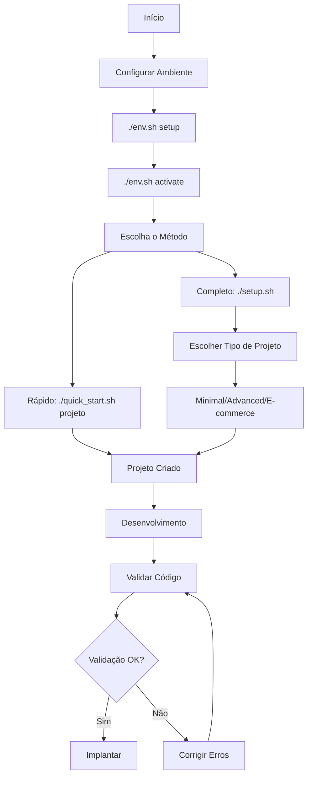
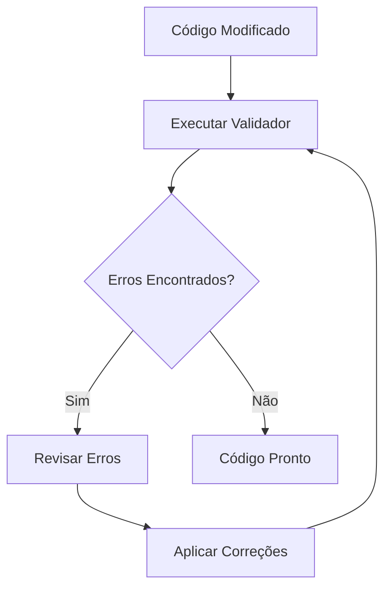
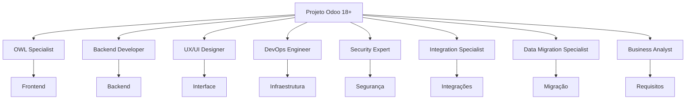
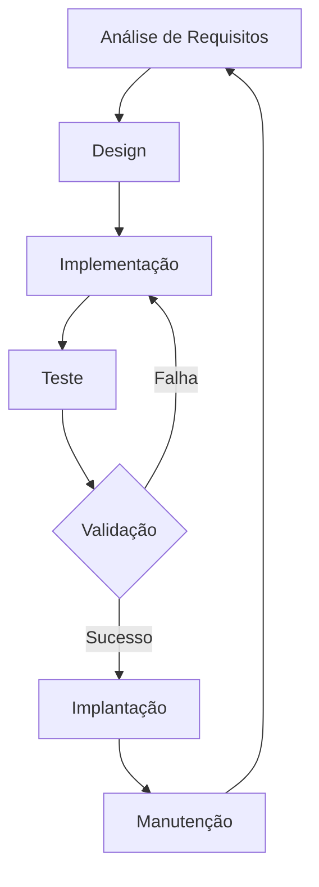
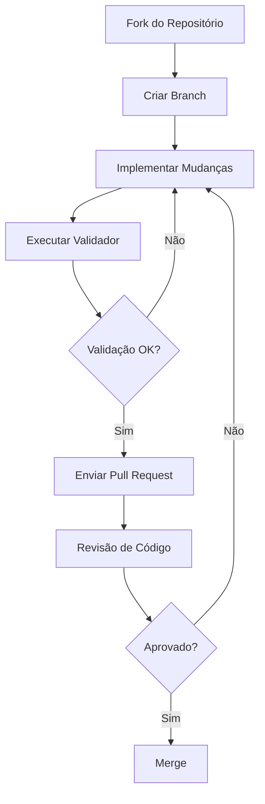

# Workflows e Processos do Neodoo18Framework

Este documento descreve os fluxos de trabalho e processos recomendados ao trabalhar com o Neodoo18Framework.

## Fluxo de Criação de Projeto

## Fluxo de Validação

## Papéis e Responsabilidades

## Ciclo de Desenvolvimento

## Processo de Contribuição

