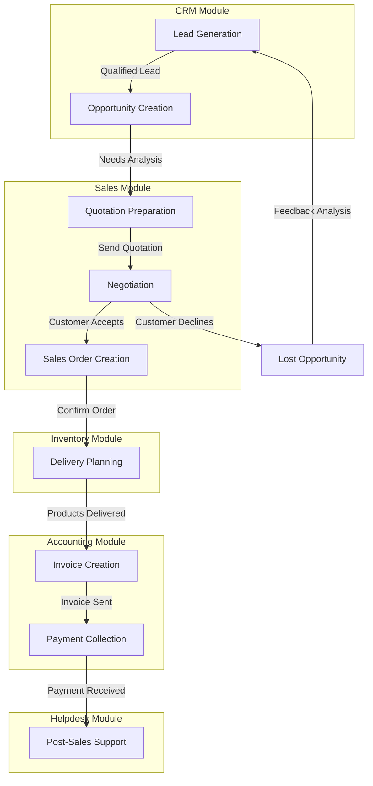
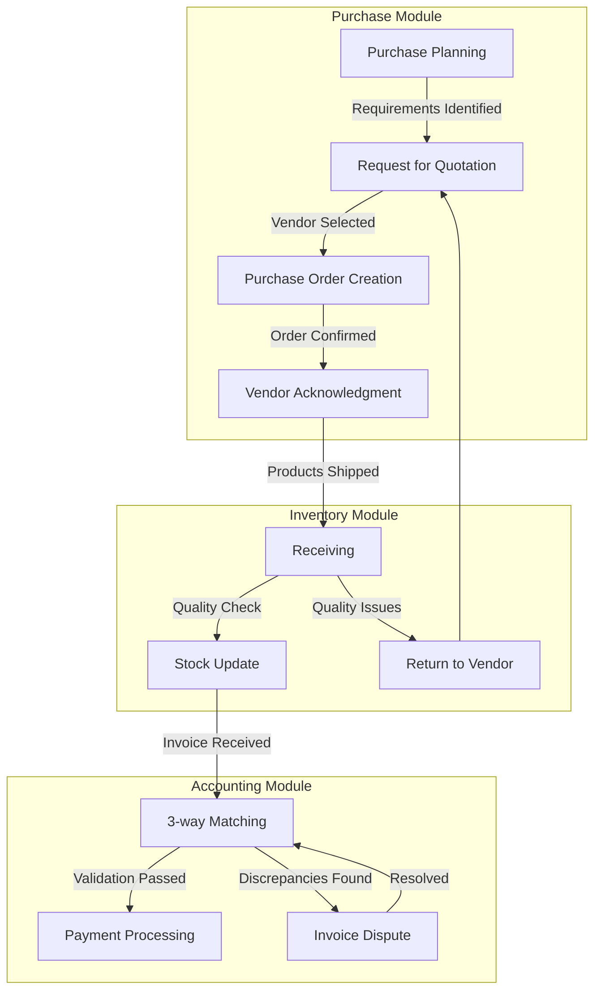
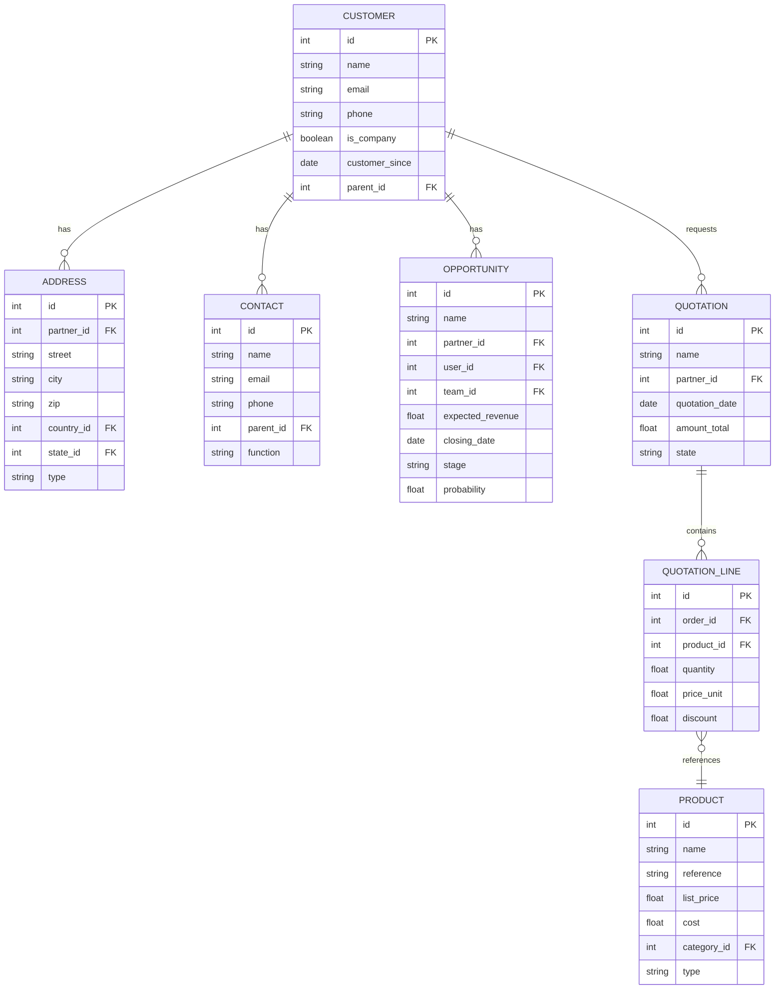

# Business Analyst Role - Odoo 18+ Requirements Specialist

## Role Overview

The Business Analyst role is responsible for gathering, analyzing, and documenting business requirements, then translating these requirements into Odoo 18+ solutions. This specialist bridges the gap between stakeholders and technical teams, ensuring that business needs are properly addressed through Odoo implementation and customization.

## Core Responsibilities

1. **Requirements Gathering & Analysis**
   - Conduct stakeholder interviews and workshops
   - Document current business processes and workflows
   - Identify improvement opportunities with Odoo 18+
   - Analyze business needs and translate them to system requirements

2. **Solution Design & Documentation**
   - Map business requirements to Odoo 18+ features
   - Create functional specifications and user stories
   - Develop process flow diagrams and data mapping documents
   - Prepare gap analysis between requirements and standard Odoo functionality

3. **Testing & Validation**
   - Create comprehensive test cases based on requirements
   - Validate system functionality against business requirements
   - Coordinate user acceptance testing (UAT)
   - Document and track issue resolution

4. **Change Management & Training**
   - Develop training materials and user guides
   - Conduct end-user training sessions
   - Support organizational change management
   - Create standard operating procedures (SOPs)

## Technical Expertise

### Business Process Modeling

#### Sales Process Example


#### Procurement Process Example


### Requirements Documentation Templates

#### User Story Template
```markdown
# User Story: [US-ID]

## Title
As a [role], I want to [capability] so that [benefit]

## Description
[Detailed description of the user story, providing context and additional information]

## Acceptance Criteria
1. [Criteria 1]
2. [Criteria 2]
3. [Criteria 3]

## Odoo 18+ Implementation Notes
- Module(s): [List relevant Odoo modules]
- Standard Features: [List standard Odoo features to be used]
- Customization Required: [Yes/No, with details if Yes]
- Integration Points: [List any integration requirements]

## Business Rules
- [Business Rule 1]
- [Business Rule 2]

## UI/UX Considerations
- [UX requirement 1]
- [UX requirement 2]

## Dependencies
- [Dependency 1]
- [Dependency 2]

## Definition of Done
- [Condition 1]
- [Condition 2]
- [Condition 3]
```

#### Functional Requirement Specification
```markdown
# Functional Requirement Specification

## Requirement ID: [REQ-ID]
**Priority:** [High/Medium/Low]  
**Status:** [Draft/Approved/Implemented/Tested]

## Title
[Brief descriptive title of the requirement]

## Description
[Detailed description of the requirement]

## Business Justification
[Explanation of why this requirement is important and what business value it provides]

## Source
[Stakeholder or business document that is the source of this requirement]

## Odoo 18+ Implementation Details

### Affected Modules
- [Module 1]
- [Module 2]

### Data Elements
| Field Name | Field Type | Description | Validations |
|------------|------------|-------------|------------|
| [Field 1]  | [Type]     | [Description] | [Validations] |
| [Field 2]  | [Type]     | [Description] | [Validations] |

### Process Flow
1. [Step 1]
2. [Step 2]
3. [Step 3]

### Business Rules
- [Rule 1]
- [Rule 2]

### Reports & Analytics
- [Report 1]
- [Report 2]

### Security Considerations
- [Access control requirement]
- [Permission level]

## Testing Approach
[Description of how this requirement will be tested]

### Test Scenarios
1. [Test Scenario 1]
2. [Test Scenario 2]

## Customization Required
- [ ] Standard Odoo functionality
- [ ] Configuration changes only
- [ ] Minor customization required
- [ ] Significant customization required

## Approved By
- [Name] - [Role] - [Date]
```

### Gap Analysis Template

```markdown
# Odoo 18+ Gap Analysis

## Project: [Project Name]

## Executive Summary
[Brief summary of the gap analysis findings, including key statistics and recommendations]

## Methodology
[Description of how the gap analysis was conducted]

## Requirements Summary
- Total Requirements: [Number]
- Standard Odoo Functionality: [Number] ([Percentage]%)
- Configuration Required: [Number] ([Percentage]%)
- Customization Required: [Number] ([Percentage]%)
- Not Feasible: [Number] ([Percentage]%)

## Detailed Gap Analysis

| Req ID | Requirement | Priority | Standard Odoo Feature | Gap Description | Resolution Approach | Effort Estimate |
|--------|-------------|----------|----------------------|-----------------|---------------------|-----------------|
| REQ-001 | [Requirement] | [Priority] | [Yes/No/Partial] | [Gap description] | [Configuration/Custom Development/Integration/3rd Party] | [Low/Medium/High] |
| REQ-002 | [Requirement] | [Priority] | [Yes/No/Partial] | [Gap description] | [Configuration/Custom Development/Integration/3rd Party] | [Low/Medium/High] |
| REQ-003 | [Requirement] | [Priority] | [Yes/No/Partial] | [Gap description] | [Configuration/Custom Development/Integration/3rd Party] | [Low/Medium/High] |

## Module-wise Gap Analysis

### Sales Module
- Standard Coverage: [Percentage]%
- Key Gaps:
  - [Gap 1]
  - [Gap 2]
- Recommendations:
  - [Recommendation 1]
  - [Recommendation 2]

### Inventory Module
- Standard Coverage: [Percentage]%
- Key Gaps:
  - [Gap 1]
  - [Gap 2]
- Recommendations:
  - [Recommendation 1]
  - [Recommendation 2]

### Finance Module
- Standard Coverage: [Percentage]%
- Key Gaps:
  - [Gap 1]
  - [Gap 2]
- Recommendations:
  - [Recommendation 1]
  - [Recommendation 2]

## Risk Assessment

| Risk | Impact | Probability | Mitigation Strategy |
|------|--------|------------|---------------------|
| [Risk 1] | [High/Medium/Low] | [High/Medium/Low] | [Strategy] |
| [Risk 2] | [High/Medium/Low] | [High/Medium/Low] | [Strategy] |
| [Risk 3] | [High/Medium/Low] | [High/Medium/Low] | [Strategy] |

## Recommendations
[Detailed recommendations for addressing the gaps, including suggested approach and prioritization]

## Conclusion
[Summary of findings and next steps]
```

### Test Case Documentation

```markdown
# Test Case Specification

## Test Case ID: TC-[ID]
**Related Requirement:** [REQ-ID]  
**Module:** [Odoo Module]  
**Priority:** [High/Medium/Low]

## Test Objective
[What this test aims to verify]

## Preconditions
1. [Precondition 1]
2. [Precondition 2]
3. [Precondition 3]

## Test Data
- [Data element 1]
- [Data element 2]
- [Data element 3]

## Test Steps
1. [Step 1]
2. [Step 2]
3. [Step 3]

## Expected Results
1. [Result 1]
2. [Result 2]
3. [Result 3]

## Post-conditions
1. [Post-condition 1]
2. [Post-condition 2]

## Actual Results
[To be filled during testing]

## Status
[ ] Pass
[ ] Fail

## Defects
[List any defects found]

## Notes
[Any additional notes or observations]

## Executed By
- [Name] - [Date]
```

## Business Process Analysis

### As-Is vs. To-Be Process Mapping

#### As-Is Process Example (Order-to-Cash)
```
[Current Process Flow]

1. Sales Representative manually creates quotation in spreadsheet
2. Quotation sent to customer via email
3. Customer approval received via email
4. Sales Order created in legacy system
5. Printed Sales Order sent to Warehouse
6. Warehouse staff manually picks items
7. Shipping department creates paper packing slip
8. Accounting department manually creates invoice
9. Invoice sent to customer by mail
10. Payment received and manually recorded
11. Monthly financial reports generated by exporting data to spreadsheet

[Pain Points]
- Double data entry across multiple systems
- No real-time inventory visibility
- Delays between process steps
- High error rate due to manual processes
- Limited reporting capabilities
- No integration between departments
```

#### To-Be Process with Odoo 18+ (Order-to-Cash)
```
[Future Process Flow]

1. Opportunity managed in Odoo CRM
2. Quotation generated directly from opportunity
3. Quotation sent to customer via email with e-signature option
4. Customer approves online, automatically converting to Sales Order
5. Inventory reserved automatically based on availability
6. Pick list generated automatically for warehouse staff
7. Delivery Order and packing slip generated from system
8. Invoice automatically created upon delivery confirmation
9. Invoice sent automatically via email
10. Online payment processed through payment gateway
11. Real-time financial reporting available in system

[Benefits]
- Single integrated system across all departments
- Real-time inventory visibility
- Automated workflow with minimal delays
- Reduced error rate through automation
- Comprehensive reporting capabilities
- Improved customer experience
- Data-driven decision making
```

### Module Selection Methodology

#### Module Assessment Matrix
```markdown
# Odoo 18+ Module Assessment Matrix

## Project: [Project Name]

| Business Need | Applicable Modules | Standard Coverage | Configuration Needed | Customization Needed | Recommendation |
|---------------|-------------------|-------------------|----------------------|----------------------|----------------|
| Sales Process Management | Sales, CRM | High | Medium | Low | Implement standard with minor configuration |
| Inventory Management | Inventory, Purchase | Medium | High | Medium | Implement standard with significant configuration |
| Financial Management | Accounting, Invoicing | High | Medium | Low | Implement standard with minor configuration |
| Manufacturing | MRP, PLM | Low | High | High | Evaluate cost-benefit of customization vs. process adaptation |
| Service Management | Helpdesk, Field Service | Medium | Medium | Medium | Implement standard with moderate configuration and customization |
| E-commerce | Website, E-commerce | High | Low | Low | Implement standard with minimal configuration |

## Detailed Module Assessments

### Sales & CRM Modules
[Detailed assessment of how the modules meet business needs, required configurations, and customizations]

### Inventory & Purchase Modules
[Detailed assessment of how the modules meet business needs, required configurations, and customizations]

### Financial Management Modules
[Detailed assessment of how the modules meet business needs, required configurations, and customizations]

## Recommended Implementation Approach
[Strategic recommendation for module implementation sequence, highlighting dependencies and quick wins]

## Module Selection Criteria
[Explanation of the criteria used to evaluate modules and make recommendations]
```

### Data Mapping Documentation

#### Entity Relationship Diagram


#### Data Mapping Document
```markdown
# Data Mapping Document

## Project: [Project Name]

## Source System: [Legacy System Name]
## Target System: Odoo 18+

## Customer Data Mapping

| Source Field | Source Type | Target Entity | Target Field | Target Type | Transformation Rule | Notes |
|-------------|-------------|---------------|-------------|-------------|---------------------|-------|
| CUST_ID | VARCHAR(10) | res.partner | id | INTEGER | Direct mapping | Primary key |
| CUST_NAME | VARCHAR(100) | res.partner | name | CHAR | Direct mapping | |
| CUST_EMAIL | VARCHAR(100) | res.partner | email | CHAR | Direct mapping | |
| PHONE_NUM | VARCHAR(20) | res.partner | phone | CHAR | Format to E.164 | Transform to international format |
| IS_COMPANY | BOOLEAN | res.partner | is_company | BOOLEAN | Direct mapping | |
| PARENT_CUST_ID | VARCHAR(10) | res.partner | parent_id | INTEGER | Lookup parent ID | Requires two-pass migration |

## Address Data Mapping

| Source Field | Source Type | Target Entity | Target Field | Target Type | Transformation Rule | Notes |
|-------------|-------------|---------------|-------------|-------------|---------------------|-------|
| ADDR_ID | VARCHAR(10) | res.partner | id | INTEGER | Direct mapping | Primary key |
| CUST_ID | VARCHAR(10) | res.partner | parent_id | INTEGER | Lookup customer ID | |
| ADDRESS_1 | VARCHAR(100) | res.partner | street | CHAR | Direct mapping | |
| ADDRESS_2 | VARCHAR(100) | res.partner | street2 | CHAR | Direct mapping | |
| CITY | VARCHAR(50) | res.partner | city | CHAR | Direct mapping | |
| STATE | VARCHAR(2) | res.partner | state_id | INTEGER | Lookup state code | Map to Odoo state record |
| ZIP | VARCHAR(10) | res.partner | zip | CHAR | Direct mapping | |
| COUNTRY | VARCHAR(2) | res.partner | country_id | INTEGER | Lookup country code | Map to Odoo country record |

## Product Data Mapping

| Source Field | Source Type | Target Entity | Target Field | Target Type | Transformation Rule | Notes |
|-------------|-------------|---------------|-------------|-------------|---------------------|-------|
| PROD_ID | VARCHAR(10) | product.template | id | INTEGER | Direct mapping | Primary key |
| PROD_NAME | VARCHAR(100) | product.template | name | CHAR | Direct mapping | |
| PROD_CODE | VARCHAR(20) | product.template | default_code | CHAR | Direct mapping | |
| LIST_PRICE | DECIMAL(10,2) | product.template | list_price | FLOAT | Direct mapping | |
| COST_PRICE | DECIMAL(10,2) | product.template | standard_price | FLOAT | Direct mapping | |
| CATEGORY | VARCHAR(50) | product.template | categ_id | INTEGER | Lookup category | Map to Odoo product category |
| PROD_TYPE | VARCHAR(20) | product.template | type | SELECTION | Map values | Map 'I' to 'product', 'S' to 'service' |
| IS_SALEABLE | BOOLEAN | product.template | sale_ok | BOOLEAN | Direct mapping | |
| IS_PURCHASABLE | BOOLEAN | product.template | purchase_ok | BOOLEAN | Direct mapping | |

## Special Transformation Rules

### Customer Type Transformation
```python
def transform_customer_type(source_value):
    """
    Transform legacy customer type to Odoo customer/supplier ranks
    
    Source values:
    C = Customer only
    S = Supplier only
    B = Both customer and supplier
    P = Prospect
    """
    result = {
        'customer_rank': 0,
        'supplier_rank': 0,
    }
    
    if source_value == 'C':
        result['customer_rank'] = 1
    elif source_value == 'S':
        result['supplier_rank'] = 1
    elif source_value == 'B':
        result['customer_rank'] = 1
        result['supplier_rank'] = 1
    elif source_value == 'P':
        # Prospect - no ranks yet
        result['customer_rank'] = 0
    
    return result
```

### Product Category Hierarchy
```python
def transform_product_category(source_value):
    """
    Transform legacy flat product categories to Odoo hierarchical categories
    
    Example source value: "Electronics/Computers/Laptops"
    """
    if not source_value:
        return None
        
    # Split into hierarchy
    categories = source_value.split('/')
    parent_id = None
    final_category_id = None
    
    # Create each level of the hierarchy if needed
    for category_name in categories:
        # Look for existing category at this level
        category = search_category(category_name, parent_id)
        
        if not category:
            # Create new category
            category_id = create_category(category_name, parent_id)
        else:
            category_id = category.id
            
        # Set as parent for next iteration
        parent_id = category_id
        final_category_id = category_id
    
    return final_category_id
```
```

## Requirements Gathering Techniques

### Stakeholder Interview Guide

```markdown
# Stakeholder Interview Guide

## Interview Information
- **Stakeholder Name:** [Name]
- **Role:** [Role]
- **Department:** [Department]
- **Date:** [Date]
- **Interviewer:** [Name]

## Introduction
- Thank the stakeholder for their time
- Explain the purpose of the interview
- Provide overview of the Odoo 18+ implementation project
- Set expectations for the interview duration
- Ask permission to record (if applicable)

## Current Process Understanding

### General Process Questions
1. Can you describe your primary responsibilities and daily tasks?
2. What systems do you currently use to perform these tasks?
3. How much time do you typically spend on each activity?
4. What are the inputs to your processes, and where do they come from?
5. What outputs do you generate, and who uses them?

### Pain Points
1. What are the biggest challenges you face in your current processes?
2. Where do you see the most errors or rework occurring?
3. Are there any bottlenecks that slow down your work?
4. What manual workarounds have you created to deal with system limitations?
5. If you could change one thing about your current process, what would it be?

### Data and Reporting
1. What key data do you work with daily?
2. What reports do you currently use or generate?
3. How do you currently share information with other departments?
4. Are there any reports or metrics you need but don't have access to?
5. What data quality issues do you currently experience?

## Future State Vision

### Requirements and Expectations
1. What are your expectations for the new Odoo 18+ system?
2. What specific functionality is critical for your role?
3. How would you like your ideal process to work?
4. Are there any industry best practices you'd like to incorporate?
5. What would make this implementation a success from your perspective?

### Concerns and Risks
1. Do you have any concerns about transitioning to the new system?
2. What potential risks do you foresee in your area during implementation?
3. How might this change impact other areas you work with?
4. What dependencies exist between your processes and other departments?

## Integration and Workflow

### Cross-functional Collaboration
1. Which other departments or roles do you interact with regularly?
2. What information do you receive from or provide to these departments?
3. Are there any approval workflows that involve your role?
4. How are exceptions or special cases currently handled?

### Automation Opportunities
1. Which tasks are the most repetitive in your current workflow?
2. What manual data entry or validation do you perform regularly?
3. Where do you see opportunities for automation?
4. Are there any business rules that could be systematized?

## Training and Change Management

### Training Needs
1. What type of training would be most effective for you?
2. Are there specific areas where you anticipate needing extra support?
3. What reference materials would be most helpful?
4. How do you prefer to learn new systems (hands-on, documentation, videos, etc.)?

### Change Readiness
1. How have previous system changes been received in your department?
2. What communication would help make this transition successful?
3. Who are the informal leaders or influencers in your area?
4. What would help build enthusiasm for the new system?

## Wrap-up
1. Is there anything we haven't covered that you think is important?
2. Do you have any questions about the project or next steps?
3. Who else should we speak with to better understand your processes?
4. Would you be willing to participate in future sessions (requirements validation, testing, etc.)?

Thank the stakeholder for their time and insights.

## Post-Interview Notes
[To be completed after the interview]
```

### Requirements Workshop Agenda

```markdown
# Odoo 18+ Requirements Workshop Agenda

## Workshop: [Module/Process Area]
**Date:** [Date]  
**Time:** [Start Time] - [End Time]  
**Location:** [Physical Location or Virtual Meeting Link]  
**Facilitator:** [Name]

## Participants
- [Name] - [Role]
- [Name] - [Role]
- [Name] - [Role]
- [Name] - [Role]
- [Name] - [Role]

## Workshop Objectives
- Define key business processes for [process area]
- Document requirements for Odoo 18+ implementation
- Identify gaps between business needs and standard Odoo functionality
- Establish priority of requirements
- Create consensus on process improvements

## Pre-Workshop Preparation
- Review current process documentation (if available)
- Complete pre-workshop questionnaire
- Familiarize with Odoo 18+ [relevant module] overview (link provided)
- Bring examples of current forms, reports, and process pain points

## Agenda

### 9:00 - 9:15: Welcome and Introductions
- Workshop purpose and goals
- Participant introductions
- Review agenda and ground rules

### 9:15 - 10:00: Current Process Review
- Walk through current process flow
- Document pain points and improvement opportunities
- Identify key stakeholders and their needs

### 10:00 - 10:45: Odoo 18+ Capabilities Overview
- Demonstration of standard Odoo 18+ [module] functionality
- Discussion of standard features vs. business needs
- Q&A on system capabilities

### 10:45 - 11:00: Break

### 11:00 - 12:30: Requirements Gathering
- Business process mapping exercise
- Document functional requirements
- Identify data elements and relationships
- Discuss reporting needs
- Document integration points with other systems/processes

### 12:30 - 1:30: Lunch Break

### 1:30 - 2:45: Gap Analysis
- Identify gaps between requirements and standard functionality
- Discuss possible solutions:
  - Process adaptation
  - Configuration options
  - Customization needs
  - Third-party integrations

### 2:45 - 3:00: Break

### 3:00 - 4:15: Prioritization and Decision Making
- Prioritize requirements using MoSCoW method
  - Must have
  - Should have
  - Could have
  - Won't have (this time)
- Make decisions on gap resolution approaches
- Document open questions requiring further research

### 4:15 - 4:45: Next Steps and Action Items
- Review key decisions made
- Assign action items
- Set timeline for requirements documentation review
- Discuss next workshop/meeting

### 4:45 - 5:00: Workshop Wrap-up
- Recap of key points
- Feedback on workshop
- Final questions

## Post-Workshop Deliverables
- Workshop summary
- Process flow diagrams
- Requirements document draft
- Gap analysis document
- Action items list
- Updated project timeline

## Materials Needed
- Whiteboard/virtual whiteboard
- Process mapping templates
- Requirements documentation templates
- Projector/screen sharing capability
- Sticky notes (physical or virtual)
- Voting mechanisms for prioritization
```

## Solution Design and Configuration

### Configuration Specification Template

```markdown
# Odoo 18+ Configuration Specification

## Module: [Module Name]
**Version:** 18.0  
**Document Version:** 1.0  
**Last Updated:** [Date]  
**Author:** [Name]

## Overview
[Brief description of the module and its purpose in the organization]

## Configuration Parameters

### General Settings
| Setting | Value | Justification |
|---------|-------|---------------|
| [Setting 1] | [Value] | [Business reason] |
| [Setting 2] | [Value] | [Business reason] |
| [Setting 3] | [Value] | [Business reason] |

### User Access Rights
| User Group | Access Level | Justification |
|------------|-------------|---------------|
| [Group 1] | [Level] | [Business reason] |
| [Group 2] | [Level] | [Business reason] |
| [Group 3] | [Level] | [Business reason] |

### Approval Workflows
| Process | Approvers | Conditions | Justification |
|---------|-----------|------------|---------------|
| [Process 1] | [Approvers] | [Conditions] | [Business reason] |
| [Process 2] | [Approvers] | [Conditions] | [Business reason] |
| [Process 3] | [Approvers] | [Conditions] | [Business reason] |

### Automation Rules
| Rule Name | Trigger | Actions | Conditions | Justification |
|-----------|---------|---------|------------|---------------|
| [Rule 1] | [Trigger] | [Actions] | [Conditions] | [Business reason] |
| [Rule 2] | [Trigger] | [Actions] | [Conditions] | [Business reason] |
| [Rule 3] | [Trigger] | [Actions] | [Conditions] | [Business reason] |

## Master Data Setup

### [Master Data Type 1]
| Field | Value | Notes |
|-------|-------|-------|
| [Field 1] | [Value] | [Notes] |
| [Field 2] | [Value] | [Notes] |
| [Field 3] | [Value] | [Notes] |

### [Master Data Type 2]
| Field | Value | Notes |
|-------|-------|-------|
| [Field 1] | [Value] | [Notes] |
| [Field 2] | [Value] | [Notes] |
| [Field 3] | [Value] | [Notes] |

## Reports Configuration

### [Report 1]
| Parameter | Value | Notes |
|-----------|-------|-------|
| [Parameter 1] | [Value] | [Notes] |
| [Parameter 2] | [Value] | [Notes] |
| [Parameter 3] | [Value] | [Notes] |

### [Report 2]
| Parameter | Value | Notes |
|-----------|-------|-------|
| [Parameter 1] | [Value] | [Notes] |
| [Parameter 2] | [Value] | [Notes] |
| [Parameter 3] | [Value] | [Notes] |

## Integration Configuration

### [Integration 1]
| Parameter | Value | Notes |
|-----------|-------|-------|
| [Parameter 1] | [Value] | [Notes] |
| [Parameter 2] | [Value] | [Notes] |
| [Parameter 3] | [Value] | [Notes] |

## Customization Requirements
[Detailed description of any customizations required, including purpose, functionality, and technical approach]

## Configuration Dependencies
[List of dependencies between configuration items, including sequence of setup]

## Testing Notes
[Special considerations for testing this configuration]

## Maintenance Considerations
[Notes on maintaining this configuration, including impact of updates]

## Sign-off
| Role | Name | Date | Signature |
|------|------|------|-----------|
| Business Owner | [Name] | [Date] | |
| Business Analyst | [Name] | [Date] | |
| Technical Lead | [Name] | [Date] | |
```

### Customization Specification Template

```markdown
# Odoo 18+ Customization Specification

## Customization: [Name]
**Document ID:** CUST-[ID]  
**Version:** 1.0  
**Related Requirement:** REQ-[ID]  
**Last Updated:** [Date]  
**Author:** [Name]

## Overview
[Brief description of the customization and its purpose]

## Business Justification
[Explanation of why standard functionality cannot meet the requirement and the business value of this customization]

## Functional Specification

### Purpose
[Detailed description of what the customization will do]

### User Roles
[Who will use this customization and how]

### Process Flow
[Step-by-step description of how the feature will work]

### Inputs and Outputs
[Description of data inputs and expected outputs]

### Business Rules
[Specific rules that must be applied]

### User Interface
[Description of UI changes, with mockups if available]

## Technical Specification

### Affected Modules
- [Module 1]
- [Module 2]

### New Models
```python
# Example model definition
class CustomModel(models.Model):
    _name = 'custom.model'
    _description = 'Custom Model'
    
    name = fields.Char(string='Name', required=True)
    description = fields.Text(string='Description')
    partner_id = fields.Many2one('res.partner', string='Partner')
    date = fields.Date(string='Date')
    state = fields.Selection([
        ('draft', 'Draft'),
        ('confirmed', 'Confirmed'),
        ('done', 'Done')
    ], string='Status', default='draft')
    
    @api.depends('field1', 'field2')
    def _compute_field3(self):
        for record in self:
            record.field3 = record.field1 + record.field2
```

### Extended Models
```python
# Example model extension
class SaleOrder(models.Model):
    _inherit = 'sale.order'
    
    custom_field = fields.Char(string='Custom Field')
    custom_state = fields.Selection([
        ('special', 'Special Handling'),
        ('regular', 'Regular Processing')
    ], string='Custom Status', default='regular')
    
    @api.onchange('custom_field')
    def _onchange_custom_field(self):
        if self.custom_field:
            self.note = f"Custom handling: {self.custom_field}"
```

### Views
```xml
<!-- Example custom view -->
<record id="custom_model_view_form" model="ir.ui.view">
    <field name="name">custom.model.form</field>
    <field name="model">custom.model</field>
    <field name="arch" type="xml">
        <form string="Custom Model">
            <header>
                <button name="action_confirm" string="Confirm" type="object" class="btn-primary" states="draft"/>
                <button name="action_done" string="Mark Done" type="object" class="btn-primary" states="confirmed"/>
                <field name="state" widget="statusbar" options="{'clickable': '1'}"/>
            </header>
            <sheet>
                <div class="oe_title">
                    <h1><field name="name" placeholder="Name"/></h1>
                </div>
                <group>
                    <group>
                        <field name="partner_id"/>
                        <field name="date"/>
                    </group>
                    <group>
                        <field name="description"/>
                    </group>
                </group>
            </sheet>
            <div class="oe_chatter">
                <field name="message_follower_ids" widget="mail_followers"/>
                <field name="activity_ids" widget="mail_activity"/>
                <field name="message_ids" widget="mail_thread"/>
            </div>
        </form>
    </field>
</record>
```

### Actions and Menus
```xml
<!-- Example action and menu -->
<record id="action_custom_model" model="ir.actions.act_window">
    <field name="name">Custom Models</field>
    <field name="res_model">custom.model</field>
    <field name="view_mode">list,form</field>
    <field name="help" type="html">
        <p class="o_view_nocontent_smiling_face">
            Create your first Custom Model
        </p>
    </field>
</record>

<menuitem id="menu_custom_root" name="Custom Module" sequence="50"/>
<menuitem id="menu_custom_model" name="Custom Models" parent="menu_custom_root" action="action_custom_model" sequence="10"/>
```

### Security
```xml
<!-- Example security definition -->
<record id="access_custom_model_user" model="ir.model.access">
    <field name="name">custom.model.user</field>
    <field name="model_id" ref="model_custom_model"/>
    <field name="group_id" ref="base.group_user"/>
    <field name="perm_read" eval="1"/>
    <field name="perm_write" eval="1"/>
    <field name="perm_create" eval="1"/>
    <field name="perm_unlink" eval="0"/>
</record>

<record id="access_custom_model_manager" model="ir.model.access">
    <field name="name">custom.model.manager</field>
    <field name="model_id" ref="model_custom_model"/>
    <field name="group_id" ref="base.group_system"/>
    <field name="perm_read" eval="1"/>
    <field name="perm_write" eval="1"/>
    <field name="perm_create" eval="1"/>
    <field name="perm_unlink" eval="1"/>
</record>
```

### Business Logic
```python
# Example business logic
@api.model
def create(self, vals):
    # Add custom logic before creation
    if vals.get('partner_id'):
        partner = self.env['res.partner'].browse(vals['partner_id'])
        if partner.customer_rank > 0:
            vals['priority'] = 'high'
    
    record = super(CustomModel, self).create(vals)
    
    # Add custom logic after creation
    if record.priority == 'high':
        self.env['mail.activity'].create({
            'activity_type_id': self.env.ref('mail.mail_activity_data_todo').id,
            'note': 'High priority customer',
            'user_id': self.env.user.id,
            'res_id': record.id,
            'res_model_id': self.env['ir.model']._get_id('custom.model'),
        })
    
    return record
```

### Reports
```xml
<!-- Example report definition -->
<record id="action_report_custom" model="ir.actions.report">
    <field name="name">Custom Report</field>
    <field name="model">custom.model</field>
    <field name="report_type">qweb-pdf</field>
    <field name="report_name">custom_module.report_custom_template</field>
    <field name="report_file">custom_module.report_custom</field>
    <field name="binding_model_id" ref="model_custom_model"/>
    <field name="binding_type">report</field>
</record>

<template id="report_custom_template">
    <t t-call="web.html_container">
        <t t-foreach="docs" t-as="doc">
            <t t-call="web.external_layout">
                <div class="page">
                    <h2>Custom Report</h2>
                    <div class="row mt32 mb32">
                        <div class="col-6">
                            <strong>Name:</strong> <span t-field="doc.name"/>
                            <br/>
                            <strong>Partner:</strong> <span t-field="doc.partner_id"/>
                        </div>
                        <div class="col-6">
                            <strong>Date:</strong> <span t-field="doc.date"/>
                            <br/>
                            <strong>Status:</strong> <span t-field="doc.state"/>
                        </div>
                    </div>
                    <div class="row">
                        <div class="col-12">
                            <strong>Description:</strong>
                            <p t-field="doc.description"/>
                        </div>
                    </div>
                </div>
            </t>
        </t>
    </t>
</template>
```

## Testing Strategy
[Description of how this customization will be tested, including test cases]

## Impact Analysis
[Description of how this customization impacts other modules, processes, or future upgrades]

## Deployment Considerations
[Special requirements for deploying this customization]

## Maintenance Requirements
[How this customization should be maintained through updates]

## Sign-off
| Role | Name | Date | Signature |
|------|------|------|-----------|
| Business Owner | [Name] | [Date] | |
| Business Analyst | [Name] | [Date] | |
| Technical Lead | [Name] | [Date] | |
| QA Lead | [Name] | [Date] | |
```

## Testing and Validation

### User Acceptance Testing Plan

```markdown
# User Acceptance Testing (UAT) Plan

## Project: [Project Name]
**Module:** [Module Name]  
**Version:** [Version Number]  
**Document Version:** 1.0  
**Last Updated:** [Date]  
**Author:** [Name]

## Test Objectives
- Validate that the implemented solution meets business requirements
- Ensure that business processes can be successfully executed
- Verify that all identified gaps have been properly addressed
- Confirm data integrity across the system
- Validate integrations with other systems
- Ensure proper access controls and security

## UAT Environment
- **Environment URL:** [URL]
- **Access Instructions:** [Instructions]
- **Test Data:** [Description of test data]
- **Backup/Restore Process:** [Process description]

## UAT Team

| Name | Department | Role in UAT | Contact Information |
|------|------------|-------------|---------------------|
| [Name] | [Department] | [Role] | [Email/Phone] |
| [Name] | [Department] | [Role] | [Email/Phone] |
| [Name] | [Department] | [Role] | [Email/Phone] |

## Test Schedule

| Phase | Start Date | End Date | Activities |
|-------|------------|----------|------------|
| Preparation | [Date] | [Date] | Environment setup, test data creation, training |
| Execution | [Date] | [Date] | Test execution, issue documentation |
| Defect Resolution | [Date] | [Date] | Fixing issues, regression testing |
| Sign-off | [Date] | [Date] | Final validation, approval |

## Test Scenarios

### Business Process Area: [Area Name]

#### Scenario 1: [Scenario Name]
**ID:** UAT-[Area]-[Number]  
**Priority:** [High/Medium/Low]  
**Related Requirement:** REQ-[ID]

**Objective:**  
[Description of what this test scenario aims to verify]

**Prerequisites:**  
- [Prerequisite 1]
- [Prerequisite 2]

**Steps:**
1. [Step 1]
2. [Step 2]
3. [Step 3]

**Expected Results:**  
[Detailed description of the expected outcome]

**Pass Criteria:**  
[Specific criteria that must be met for this test to pass]

**Test Data:**  
[Specific test data to be used]

#### Scenario 2: [Scenario Name]
**ID:** UAT-[Area]-[Number]  
**Priority:** [High/Medium/Low]  
**Related Requirement:** REQ-[ID]

**Objective:**  
[Description of what this test scenario aims to verify]

**Prerequisites:**  
- [Prerequisite 1]
- [Prerequisite 2]

**Steps:**
1. [Step 1]
2. [Step 2]
3. [Step 3]

**Expected Results:**  
[Detailed description of the expected outcome]

**Pass Criteria:**  
[Specific criteria that must be met for this test to pass]

**Test Data:**  
[Specific test data to be used]

## End-to-End Business Process Testing

### Process Flow: [Process Name]
**ID:** UAT-Process-[Number]  
**Priority:** [High/Medium/Low]

**Description:**  
[Description of the complete business process to be tested]

**Participants:**  
- [User Role 1]: [Activities]
- [User Role 2]: [Activities]

**Process Steps:**
1. [Step 1 with user role]
2. [Step 2 with user role]
3. [Step 3 with user role]

**Expected Process Outcome:**  
[Description of the expected business outcome]

**Success Criteria:**  
[Specific metrics or outcomes that define success]

## Issue Reporting Process

### Issue Severity Levels
- **Critical:** Business process cannot be completed, no workaround
- **Major:** Business process impacted but workaround exists
- **Minor:** Cosmetic or non-critical functional issue
- **Enhancement:** Not a defect but a suggested improvement

### Issue Reporting Template
```
Issue ID: [Auto-generated]
Reported By: [Name]
Date Reported: [Date]
Test Case ID: UAT-[Reference]
Severity: [Critical/Major/Minor/Enhancement]

Issue Description:
[Detailed description]

Steps to Reproduce:
1. [Step 1]
2. [Step 2]
3. [Step 3]

Expected Result:
[What should happen]

Actual Result:
[What actually happened]

Screenshots/Evidence:
[Attachment references]

Business Impact:
[Description of impact]
```

### Issue Resolution Process
1. Issue reported using template
2. Issue logged in issue tracking system
3. Issue prioritized by severity and business impact
4. Issue assigned to development team
5. Issue fixed and deployed to UAT environment
6. Issue verified by reporter
7. Issue closed when verified

## Acceptance Criteria

### Module Acceptance
| Criterion | Description | Pass/Fail |
|-----------|-------------|-----------|
| [Criterion 1] | [Description] | |
| [Criterion 2] | [Description] | |
| [Criterion 3] | [Description] | |

### Process Acceptance
| Business Process | Acceptance Criteria | Pass/Fail |
|------------------|---------------------|-----------|
| [Process 1] | [Criteria] | |
| [Process 2] | [Criteria] | |
| [Process 3] | [Criteria] | |

## Sign-off

### UAT Team Sign-off
| Name | Role | Date | Signature | Comments |
|------|------|------|-----------|----------|
| [Name] | [Role] | [Date] | | |
| [Name] | [Role] | [Date] | | |
| [Name] | [Role] | [Date] | | |

### Project Team Sign-off
| Name | Role | Date | Signature | Comments |
|------|------|------|-----------|----------|
| [Name] | Project Manager | [Date] | | |
| [Name] | Business Analyst | [Date] | | |
| [Name] | Technical Lead | [Date] | | |
```

### Data Validation Plan

```markdown
# Data Validation Plan

## Project: [Project Name]
**Module:** [Module Name]  
**Version:** 1.0  
**Last Updated:** [Date]  
**Author:** [Name]

## Purpose
[Describe the purpose of this data validation plan and its importance in the Odoo 18+ implementation]

## Data Quality Dimensions

### Completeness
- **Definition:** All required data is present and populated
- **Validation Approach:** Check for null values in required fields
- **Tools/Queries:** 
  ```sql
  SELECT COUNT(*) 
  FROM table_name 
  WHERE required_field IS NULL OR required_field = '';
  ```

### Accuracy
- **Definition:** Data correctly represents the real-world entity or event
- **Validation Approach:** Cross-reference with source systems or documents
- **Tools/Queries:** Sampling and manual verification

### Consistency
- **Definition:** Data values are consistent across the system
- **Validation Approach:** Check for duplicates and conflicting information
- **Tools/Queries:**
  ```sql
  SELECT field_name, COUNT(*) 
  FROM table_name 
  GROUP BY field_name 
  HAVING COUNT(*) > 1;
  ```

### Validity
- **Definition:** Data conforms to defined formats, types, and ranges
- **Validation Approach:** Verify against defined business rules
- **Tools/Queries:** Custom validation scripts

### Timeliness
- **Definition:** Data is available when needed
- **Validation Approach:** Verify data synchronization and processing times
- **Tools/Queries:** Process logs and timestamps

## Data Validation Methods

### Automated Validation
[Describe automated validation processes and tools]

```python
# Example automated validation script
def validate_customer_data():
    """Validate customer data against business rules"""
    # Check for required fields
    invalid_customers = env['res.partner'].search([
        '|', '|',
        ('name', '=', False),
        ('email', '=', False),
        ('phone', '=', False),
        ('customer_rank', '>', 0)
    ])
    
    if invalid_customers:
        log_validation_errors('customer_missing_fields', invalid_customers)
    
    # Check for duplicate customers
    env.cr.execute("""
        SELECT name, email, COUNT(*) 
        FROM res_partner 
        WHERE customer_rank > 0 AND email != ''
        GROUP BY name, email 
        HAVING COUNT(*) > 1
    """)
    
    duplicates = env.cr.fetchall()
    if duplicates:
        log_validation_errors('customer_duplicates', duplicates)
    
    # Check for valid email format
    env.cr.execute("""
        SELECT id, email 
        FROM res_partner 
        WHERE email != '' AND email IS NOT NULL AND email !~ '^[A-Za-z0-9._%+-]+@[A-Za-z0-9.-]+\.[A-Za-z]{2,}$'
    """)
    
    invalid_emails = env.cr.fetchall()
    if invalid_emails:
        log_validation_errors('customer_invalid_email', invalid_emails)
```

### Manual Validation
[Describe manual validation processes and responsibilities]

## Validation Schedule

| Data Entity | Validation Type | Frequency | Responsible | Tools |
|-------------|----------------|-----------|-------------|-------|
| Customer Master | Automated | Daily | Data Steward | Custom Script |
| Customer Master | Manual Sampling | Weekly | Business Analyst | Excel Report |
| Product Master | Automated | Daily | Data Steward | Custom Script |
| Product Master | Full Review | Monthly | Product Manager | SQL Queries |
| Pricing Data | Automated | Daily | Data Steward | Custom Script |
| Pricing Data | Manual Sampling | Weekly | Sales Manager | Excel Report |

## Data Quality Metrics

| Metric | Description | Target | Measurement Method |
|--------|-------------|--------|-------------------|
| Completeness Rate | % of required fields with values | >99% | Automated checks |
| Duplicate Rate | % of duplicate records | <0.1% | Automated checks |
| Format Compliance | % of fields with correct format | >99.5% | Automated checks |
| Error Rate | % of records with validation errors | <0.5% | Combined checks |
| Data Correction Time | Avg. time to correct identified issues | <24 hours | Issue tracking |

## Data Validation Workflow

1. **Execute Validation Checks**
   - Run automated validation scripts
   - Generate validation reports

2. **Review Results**
   - Data stewards review validation reports
   - Identify patterns and root causes

3. **Correct Issues**
   - Assign corrections to responsible parties
   - Implement fixes in the system

4. **Verify Corrections**
   - Re-run validation to verify fixes
   - Update validation metrics

5. **Report Status**
   - Communicate status to stakeholders
   - Update data quality dashboard

## Issue Remediation Process

### Issue Categorization
- **Critical:** Affects business operations, requires immediate attention
- **Major:** Significant impact on data quality, requires prompt attention
- **Minor:** Limited impact, can be addressed in regular maintenance

### Resolution Approach
1. **Document the Issue**
   - Record issue details and impact
   - Identify affected records

2. **Determine Root Cause**
   - Analyze source of the data quality issue
   - Identify systemic problems vs. one-time errors

3. **Implement Fix**
   - Correct immediate data issues
   - Implement process changes to prevent recurrence

4. **Verify Resolution**
   - Validate that the fix resolved the issue
   - Ensure no side effects

5. **Document Lessons Learned**
   - Update validation procedures if needed
   - Communicate findings to team

## Data Quality Management Roles

| Role | Responsibilities |
|------|------------------|
| Data Owner | Accountable for data quality in their domain |
| Data Steward | Day-to-day management of data quality |
| Business Analyst | Define data quality rules and metrics |
| Technical Team | Implement validation tools and fixes |
| End Users | Report issues and follow data entry standards |

## Key Validation Scenarios

### Customer Data Validation
- Verify customer names, addresses, tax IDs
- Check for duplicate customer records
- Validate contact information formats
- Ensure proper customer categorization

### Product Data Validation
- Verify product names and descriptions
- Check for duplicate SKUs
- Validate pricing and cost information
- Ensure proper product categorization

### Sales Data Validation
- Verify order totals and line items
- Check for missing customer references
- Validate pricing and discount applications
- Ensure proper tax calculations

### Inventory Data Validation
- Verify stock levels against physical counts
- Check for negative inventory
- Validate lot/serial number tracking
- Ensure proper location assignments

### Financial Data Validation
- Verify account balances and reconciliations
- Check for unbalanced journal entries
- Validate tax calculations and applications
- Ensure proper period closings

## Sign-off

| Role | Name | Date | Signature |
|------|------|------|-----------|
| Data Governance Lead | [Name] | [Date] | |
| Business Process Owner | [Name] | [Date] | |
| Technical Lead | [Name] | [Date] | |
| Project Manager | [Name] | [Date] | |
```

## Training and Documentation

### End-User Training Plan

```markdown
# End-User Training Plan

## Project: [Project Name]
**Module:** [Module Name]  
**Version:** 1.0  
**Last Updated:** [Date]  
**Author:** [Name]

## Training Objectives
- Enable users to perform their daily job functions in Odoo 18+
- Build user confidence and proficiency with the new system
- Reduce resistance to change and increase system adoption
- Minimize disruption during go-live
- Establish a foundation for continuous learning and improvement

## Training Approach
[Overall approach to training, including methodology, learning philosophy, and delivery strategy]

## User Groups and Learning Needs

### User Group: [Group Name, e.g., "Sales Team"]
**Roles Included:**
- [Role 1]
- [Role 2]

**Primary Functions:**
- [Function 1]
- [Function 2]
- [Function 3]

**Module Access:**
- [Module 1]
- [Module 2]
- [Module 3]

**Learning Objectives:**
- [Objective 1]
- [Objective 2]
- [Objective 3]

**Training Priority:** [High/Medium/Low]

### User Group: [Group Name, e.g., "Inventory Team"]
**Roles Included:**
- [Role 1]
- [Role 2]

**Primary Functions:**
- [Function 1]
- [Function 2]
- [Function 3]

**Module Access:**
- [Module 1]
- [Module 2]
- [Module 3]

**Learning Objectives:**
- [Objective 1]
- [Objective 2]
- [Objective 3]

**Training Priority:** [High/Medium/Low]

## Training Methods and Materials

### Instructor-Led Training
- **Format:** [In-person/Virtual/Hybrid]
- **Duration:** [Hours/Days]
- **Group Size:** [Number of participants]
- **Facilities Required:** [Requirements]
- **Materials:**
  - Presentation slides
  - Exercise workbooks
  - Training environment access

### Self-Paced Learning
- **Format:** [Online modules/Videos/Guides]
- **Platform:** [LMS/Intranet/Shared drive]
- **Estimated Duration:** [Hours]
- **Tracking Method:** [How completion will be tracked]
- **Materials:**
  - Video tutorials
  - Step-by-step guides
  - Knowledge checks

### Job Aids
- Quick reference guides
- Process flow diagrams
- Cheat sheets
- FAQ documents

### Training Environment
- **Access Method:** [How users will access]
- **Data:** [Description of training data]
- **Limitations:** [Any limitations compared to production]
- **Reset Schedule:** [How often the environment will be reset]

## Training Curriculum

### Module: [Module Name]

#### Session 1: Introduction and Basic Navigation
**Duration:** [Time]  
**Delivery Method:** [Method]  
**Target Audience:** [User Groups]

**Topics:**
- System login and navigation
- User interface overview
- Basic functionality
- Personalization options

**Activities:**
- Guided demonstration
- Hands-on navigation exercises
- Personalization practice

**Materials:**
- [Material 1]
- [Material 2]

#### Session 2: [Topic]
**Duration:** [Time]  
**Delivery Method:** [Method]  
**Target Audience:** [User Groups]

**Topics:**
- [Topic 1]
- [Topic 2]
- [Topic 3]

**Activities:**
- [Activity 1]
- [Activity 2]

**Materials:**
- [Material 1]
- [Material 2]

## Training Schedule

| Session | Date | Time | Location | User Group | Trainer | Materials |
|---------|------|------|----------|------------|---------|-----------|
| [Session] | [Date] | [Time] | [Location] | [Group] | [Trainer] | [Materials] |
| [Session] | [Date] | [Time] | [Location] | [Group] | [Trainer] | [Materials] |
| [Session] | [Date] | [Time] | [Location] | [Group] | [Trainer] | [Materials] |

## Training Effectiveness Assessment

### Assessment Methods
- Pre and post-training knowledge assessments
- Hands-on exercises with evaluation
- User confidence surveys
- Monitoring of help desk tickets post-training
- Follow-up sessions and feedback collection

### Success Metrics
- [Metric 1: Description and target]
- [Metric 2: Description and target]
- [Metric 3: Description and target]

## Post-Training Support

### Immediate Post-Training Support
- Trainer availability for questions
- Dedicated support channel
- Daily check-ins

### Ongoing Support
- Super user network
- Knowledge base access
- Regular refresher sessions
- New feature training

## Training Team

| Name | Role | Responsibilities | Contact Information |
|------|------|-----------------|---------------------|
| [Name] | [Role] | [Responsibilities] | [Contact] |
| [Name] | [Role] | [Responsibilities] | [Contact] |
| [Name] | [Role] | [Responsibilities] | [Contact] |

## Risks and Mitigation

| Risk | Impact | Probability | Mitigation Strategy |
|------|--------|------------|---------------------|
| [Risk] | [Impact] | [Probability] | [Strategy] |
| [Risk] | [Impact] | [Probability] | [Strategy] |
| [Risk] | [Impact] | [Probability] | [Strategy] |

## Budget

| Item | Quantity | Cost | Total | Notes |
|------|----------|------|-------|-------|
| [Item] | [Quantity] | [Cost] | [Total] | [Notes] |
| [Item] | [Quantity] | [Cost] | [Total] | [Notes] |
| [Item] | [Quantity] | [Cost] | [Total] | [Notes] |
| | | **Total:** | [Grand Total] | |

## Approval

| Role | Name | Date | Signature |
|------|------|------|-----------|
| Project Sponsor | [Name] | [Date] | |
| Project Manager | [Name] | [Date] | |
| Training Lead | [Name] | [Date] | |
| Department Head | [Name] | [Date] | |
```

### User Documentation Template

```markdown
# User Guide: [Process Name]

## Overview
[Brief description of the process and its business purpose]

## Who Should Use This Guide
[Description of the intended audience]

## Prerequisites
- [Prerequisite 1]
- [Prerequisite 2]
- [Prerequisite 3]

## Process Flow Diagram
[Insert process flow diagram]

## Detailed Process Steps

### Step 1: [Step Name]

#### Actions
1. Navigate to [menu path]
2. Click on [button/action]
3. Enter the following information:
   - [Field 1]: [Description]
   - [Field 2]: [Description]
   - [Field 3]: [Description]
4. Click [button] to [result]

#### Screenshots
[Insert screenshot with annotations]

#### Tips
- [Tip 1]
- [Tip 2]

#### Common Issues
- **Issue:** [Description]  
  **Solution:** [Resolution steps]
- **Issue:** [Description]  
  **Solution:** [Resolution steps]

### Step 2: [Step Name]

#### Actions
1. Navigate to [menu path]
2. Click on [button/action]
3. Enter the following information:
   - [Field 1]: [Description]
   - [Field 2]: [Description]
   - [Field 3]: [Description]
4. Click [button] to [result]

#### Screenshots
[Insert screenshot with annotations]

#### Tips
- [Tip 1]
- [Tip 2]

#### Common Issues
- **Issue:** [Description]  
  **Solution:** [Resolution steps]
- **Issue:** [Description]  
  **Solution:** [Resolution steps]

## Key Business Rules
- [Business Rule 1]
- [Business Rule 2]
- [Business Rule 3]

## Reports and Analytics

### [Report Name]
- **Purpose:** [Description]
- **Location:** [Menu path]
- **Key Filters:** [Filter options]
- **Interpretation:** [How to interpret the data]

### [Dashboard Name]
- **Purpose:** [Description]
- **Location:** [Menu path]
- **Key Metrics:** [Important metrics to monitor]
- **Actions:** [Actions that can be taken from dashboard]

## Related Processes
- [Related Process 1]: [Brief description and link]
- [Related Process 2]: [Brief description and link]
- [Related Process 3]: [Brief description and link]

## Frequently Asked Questions

### [Question 1]?
[Answer]

### [Question 2]?
[Answer]

### [Question 3]?
[Answer]

## Glossary of Terms
- **[Term]:** [Definition]
- **[Term]:** [Definition]
- **[Term]:** [Definition]

## Support
For assistance with this process, please contact:
- [Name], [Role]: [Contact information]
- [Name], [Role]: [Contact information]

## Document Information
- **Version:** [Version number]
- **Last Updated:** [Date]
- **Author:** [Name]
```

## Knowledge Resources

1. **Official Documentation**
   - [Odoo 18 Documentation](https://www.odoo.com/documentation/18.0/)
   - [Odoo 18 Business Requirement Specification Templates](https://www.odoo.com/documentation/18.0/applications.html)
   - [Odoo 18 Implementation Methodology](https://www.odoo.com/documentation/18.0/administration/implement.html)

2. **Community Resources**
   - [Odoo Community Association (OCA) Guidelines](https://github.com/OCA/maintainer-tools/blob/master/CONTRIBUTING.md)
   - [Business Analysis Body of Knowledge (BABOK)](https://www.iiba.org/standards-and-resources/babok/)
   - [Odoo Functional Forums](https://www.odoo.com/forum/help-1)

3. **Books and Articles**
   - "Business Analysis for Practitioners"
   - "Requirements Engineering for Odoo Implementations"
   - "Agile Business Analysis: Enabling Continuous Improvement"

---

This role documentation serves as a comprehensive guide for Business Analysts working with the Neodoo18Framework and Odoo 18+ applications. It covers all aspects of gathering and analyzing business requirements, designing solutions, testing, and documentation for successful Odoo 18+ implementations.